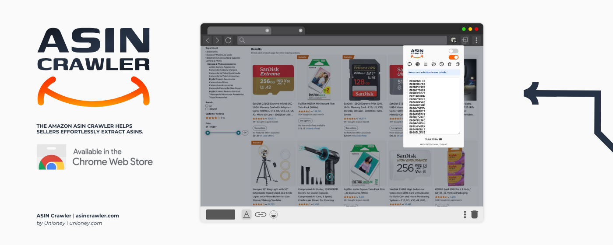
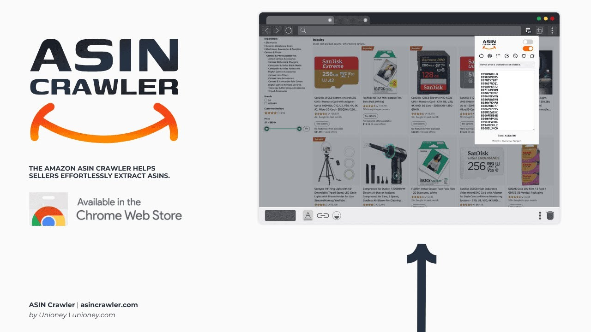
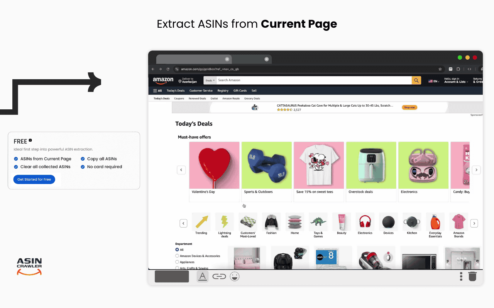
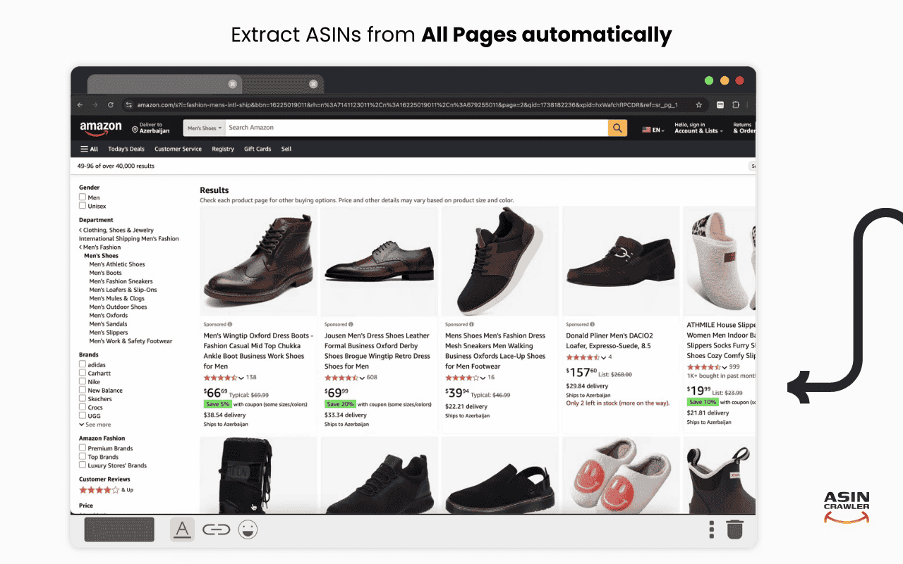
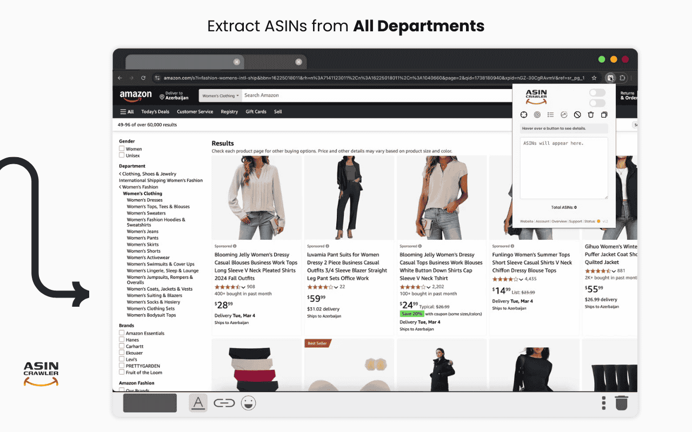
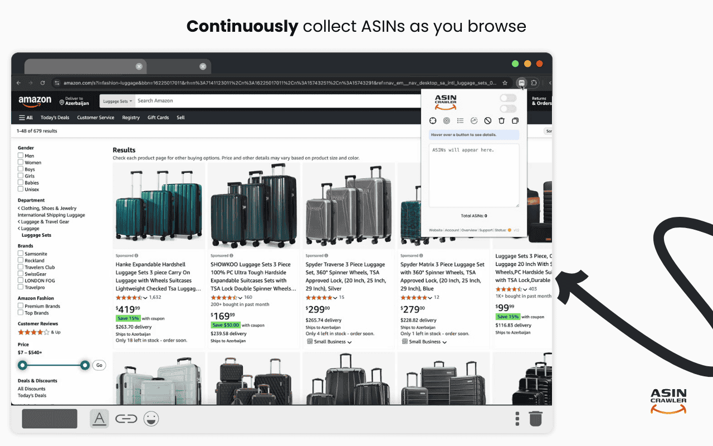

  

  
  
  
  

# ASIN Crawler: Amazon ASIN scraper for Chrome

**ASIN Crawler** is a free Chrome extension that collects every **Amazon ASIN** from search, category and best-seller pages into one clean list you can copy. Use it as an ASIN scraper, ASIN grabber or ASIN extractor for product research, sourcing lists and competitor tracking, on **23 Amazon marketplaces**.

**[Add to Chrome for free](https://chromewebstore.google.com/detail/asin-crawler/fbbicfggdppkgfpfnencfeadophkghpe)** · [Website](https://asincrawler.com/?utm_source=github&utm_medium=referral&utm_campaign=readme) · [Documentation](https://asincrawler.com/documentation?utm_source=github&utm_medium=referral&utm_campaign=readme) · [Pricing](https://asincrawler.com/pricing?utm_source=github&utm_medium=referral&utm_campaign=readme) · [FAQ](https://asincrawler.com/faq?utm_source=github&utm_medium=referral&utm_campaign=readme)

## Watch it work

## Four ways to collect ASINs

| Mode | Plan | What it does |
|---|---|---|
| **Current Page** | Free | Collect every ASIN on the Amazon page you are looking at, in one click. No account needed. |
| **All Pages** | PRO | Start on a search or category page and let ASIN Crawler move through every result page for you. |
| **All Departments** | PRO | Crawl a whole department: ASIN Crawler finds the category links and collects each one. |
| **Dynamic** | PRO | Keep browsing as usual in one tab. New ASINs are added to your list as they appear. |

| Current Page | All Pages |
|---|---|
|  |  |
| **All Departments** | **Dynamic** |
|  |  |

**Also included:** add the Amazon product URL before each ASIN (PRO), keep only ASINs that start with "B" (PRO), copy or clear the whole list in one click, a side panel that stays open while you switch tabs, a live count on the extension icon, and both sponsored and organic results (never footer or promo links).

## Which pages it reads

Search results · Category and browse grids · Best Sellers · New Releases · Deals · Landing-page product grids · Product detail pages

## 23 Amazon marketplaces

| Americas | Europe | Middle East & Africa | Asia-Pacific |
|---|---|---|---|
| 🇺🇸 amazon.com | 🇬🇧 amazon.co.uk | 🇹🇷 amazon.com.tr | 🇮🇳 amazon.in |
| 🇨🇦 amazon.ca | 🇩🇪 amazon.de | 🇦🇪 amazon.ae | 🇯🇵 amazon.co.jp |
| 🇲🇽 amazon.com.mx | 🇫🇷 amazon.fr | 🇸🇦 amazon.sa | 🇦🇺 amazon.com.au |
| 🇧🇷 amazon.com.br | 🇮🇹 amazon.it | 🇪🇬 amazon.eg | 🇸🇬 amazon.sg |
| | 🇪🇸 amazon.es | 🇿🇦 amazon.co.za | |
| | 🇳🇱 amazon.nl | | |
| | 🇸🇪 amazon.se | | |
| | 🇵🇱 amazon.pl | | |
| | 🇧🇪 amazon.com.be | | |
| | 🇮🇪 amazon.ie | | |

## Pricing

| Plan | Price | Includes |
|---|---|---|
| **Free** | $0 forever | ASINs from the current page, copy or clear your list. No account or card required. |
| **Starter** | $0, once | Connect a free account and get **500 PRO ASINs** to try every PRO feature. No subscription, no card. |
| **PRO Daily** | $1 every 24 hours | Every PRO mode and option, no ASIN cap. Renews every 24 hours until you cancel. |
| **PRO Monthly** | $24.90 per month | Every PRO mode and option, no ASIN cap. Renews monthly until you cancel. |

Upgrade from the extension's side panel whenever you need more. Cancel any time from your [account](https://asincrawler.com/account). Prices in USD.

## Get started

1. [Add ASIN Crawler to Chrome](https://chromewebstore.google.com/detail/asin-crawler/fbbicfggdppkgfpfnencfeadophkghpe) (Chrome 114 or newer; it uses the side panel).
2. Open an Amazon search, category or best-seller page.
3. Click the ASIN Crawler icon to open the side panel and pick a mode.
4. Watch the count climb, then copy your ASIN list in one click.

## Privacy

Your ASIN list is stored locally in your browser, not on our servers. The Free plan works without an account. If you connect an account, we store your email, your plan status, how many of your free PRO ASINs you have used and how many ASINs you have collected in total (a number only, never the ASINs themselves). Details: [Privacy Policy](https://asincrawler.com/legal/privacy-policy).

## FAQ

**Is ASIN Crawler an ASIN scraper, grabber or extractor?**
All three names describe the same job: it reads the product cards on the Amazon pages you open and turns them into one list of ASINs.

**Do I need code, an API key or a proxy?**
No. It runs in Chrome's side panel on the pages you already have open.

**Do I need to be logged into Amazon?**
No. You do not need an Amazon account to collect ASINs.

More answers in the [full FAQ](https://asincrawler.com/faq?utm_source=github&utm_medium=referral&utm_campaign=readme).

## About this repository

This repository holds the README and media for ASIN Crawler. The extension itself is distributed only through the [Chrome Web Store](https://chromewebstore.google.com/detail/asin-crawler/fbbicfggdppkgfpfnencfeadophkghpe); its source code is not published here.

## Support

- Email: [support@asincrawler.com](mailto:support@asincrawler.com)
- Website: [asincrawler.com/contact](https://asincrawler.com/contact)
- X: [@ASINCrawler](https://x.com/ASINCrawler)

---

ASIN Crawler is built by [Unioney](https://unioney.com). Not affiliated with Amazon. Amazon is a trademark of Amazon.com, Inc.
